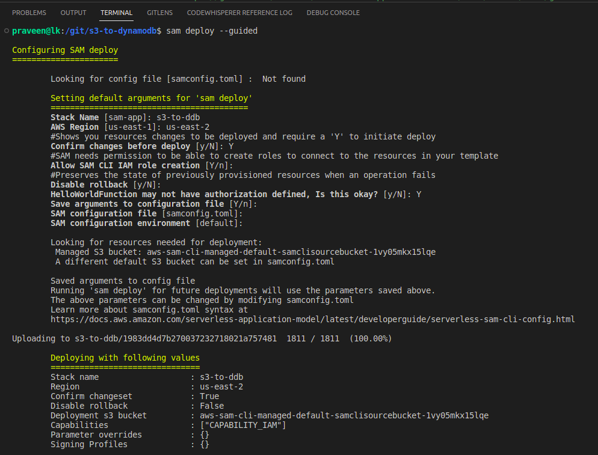
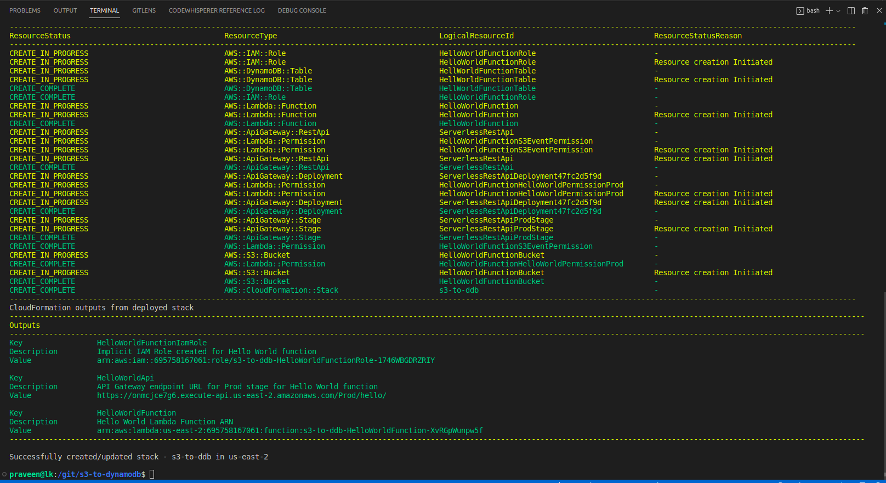
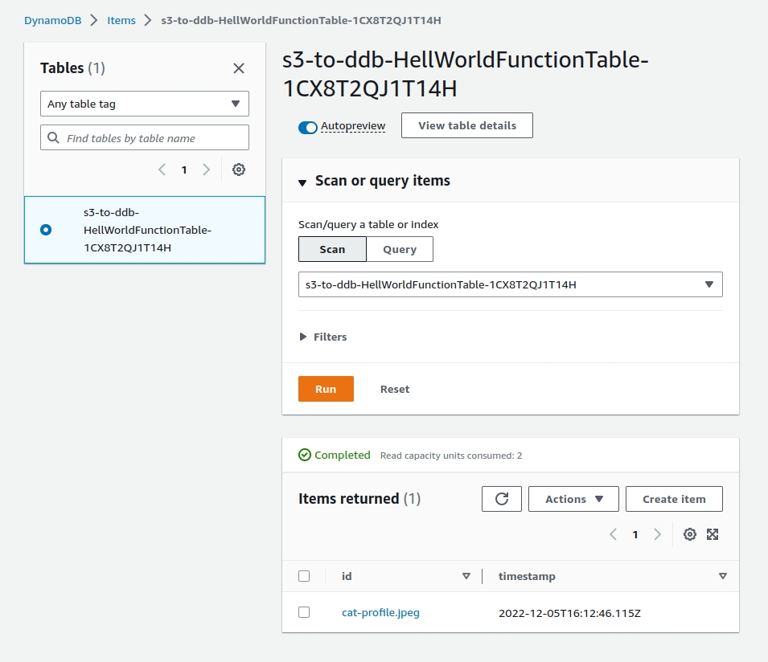

# S3 to DynamoDB

Upload to S3 triggers Lambda. Lambda puts a record in DynamoDB.

Authored with SAM Framework. (AWS Serverless Application Model)

# SAM Init


# SAM Deploy --guided







# Delete Stack

```
aws cloudformation delete-stack --stack-name s3-to-ddb --region us-east-2
```